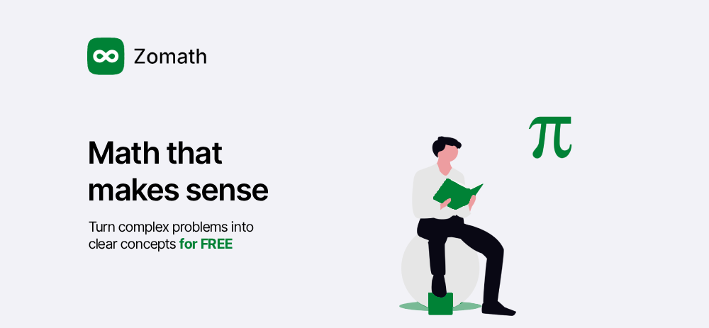

<p align="center">
  
</p>

# Zomath

Zomath is an AI-powered learning platform where your work lives in **Projects** and **Journals**. **Newton**, the AI tutor, is a tool you reach for inside that work to understand concepts, solve problems, and go deeper into math.

> Turn complex problems into clear concepts, for free.

## ✨ Features

### Projects and Journals
The core of Zomath. Projects are containers for all your learning material including Journals, notes, files, PDFs, lecture slides, videos, links, questions, and everything you need for studying. Journals are Newton-powered full-text editors for writing, working through problems, taking notes, and organizing your thinking. Both support LaTeX math rendering, code blocks, and markdown.

### Newton AI Tutor
Ask Newton anything. Why does a theorem work? How do I approach this proof? What does this concept mean? Newton adapts to your level and never gives bare answers, always explains the reasoning behind every step.

### Solve
Snap or upload a photo of any math problem (handwritten, printed, or on a whiteboard). Newton reads it, identifies the problem type, and walks you through a complete step by step solution. Ask follow up questions mid-solution or request alternative methods.

### Practice
Adaptive drills that target your weak spots. Supports three formats:
- Quiz: multiple choice with instant feedback and hints
- Match up: drag and drop concept matching
- Flashcards: spaced repetition with AI-generated card edits

### History
A log of every Newton conversation and Solve session so you can revisit explanations and pick up where you left off.

---

## 🛠️ Tech Stack

- **Frontend:** Next.js 16, React 19, TypeScript, Tailwind CSS
- **Database:** Turso (LibSQL) with Drizzle ORM
- **Local Storage:** Dexie (IndexedDB for fast local journaling with background sync to cloud)
- **AI & LLM:** OpenRouter, Vercel AI SDK, Tavily search
- **Auth:** Better Auth
- **Editor:** Lexical-based editor forked from [shadcn-editor](https://github.com/htmujahid/shadcn-editor) with full markdown, LaTeX, and code support
- **UI Components:** shadcn/ui, Radix UI, Hugeicons
- **AI Elements:** [Vercel AI Elements](https://elements.ai-sdk.dev/) for Newton voice and text mode UI
- **Animation:** Framer Motion, Tailwind CSS animations
- **Code Quality:** Biome for linting and formatting

---

## 🚀 Getting Started

### Prerequisites
- Node.js 18+ and pnpm 10+
- An OpenRouter API key (for AI features)

### Installation

1. **Clone the repository**
   ```bash
   git clone https://github.com/yourusername/zomath.git
   cd zomath
   ```

2. **Install dependencies**
   ```bash
   pnpm install
   ```

3. **Set up environment variables**
   ```bash
   cp .env.example .env.local
   ```
   
   Update `.env.local` with your credentials:
   
   | Service | Variable | Purpose |
   |---------|----------|---------|
   | Better Auth | `BETTER_AUTH_SECRET`, `BETTER_AUTH_URL`, `BETTER_AUTH_API_KEY` | User authentication |
   | GitHub OAuth | `GITHUB_CLIENT_ID`, `GITHUB_CLIENT_SECRET` | GitHub login provider |
   | Google OAuth | `GOOGLE_CLIENT_ID`, `GOOGLE_CLIENT_SECRET` | Google login provider |
   | OpenRouter | `OPENROUTER_API_KEY` | LLM API for all AI features (Newton tutor, problem solving, practice, research) |
   | Tavily | `TAVILY_API_KEY` | Web search for AI responses |
   | ElevenLabs | `ELEVENLABS_API_KEY` | Text-to-speech for tutorials |
   | Vercel Blob | `BLOB_READ_WRITE_TOKEN` | File storage for PDFs and uploads |
   | Turso | `TURSO_DATABASE_URL`, `TURSO_AUTH_TOKEN` | Database credentials |
   | Polar | `POLAR_ACCESS_TOKEN`, `POLAR_PLUS_MONTHLY_ID`, `POLAR_PLUS_YEARLY_ID`, `POLAR_WEBHOOK_SECRET` | Subscription management |
   | BetterStack | `BETTERSTACK_API_TOKEN` | Error tracking and monitoring |

4. **Set up the database**
   ```bash
   pnpm db:push
   ```

---

## 🏃 Running the Project

### Development
Start the development server with Turbopack for fast iteration:
```bash
pnpm dev
```
Open [http://localhost:3000](http://localhost:3000) in your browser.

### Production
Build and start the production server:
```bash
pnpm build
pnpm start
```

### Database Management
- **Push schema changes:** `pnpm db:push`
- **Generate migrations:** `pnpm db:generate`
- **Open studio:** `pnpm db:studio`
- **Reset database:** `pnpm db:reset`

### Code Quality
- **Lint:** `pnpm lint`
- **Format:** `pnpm format`
- **Type check:** `pnpm typecheck`
- **Full check:** `pnpm check`

---

## 📁 Project Structure

```
zomath/
├── app/                 # Next.js app router
├── components/          # Reusable React components
├── lib/                 # Utilities and helpers
├── public/              # Static assets (images, fonts)
├── db/                  # Database schema and migrations
├── styles/              # Global styles
└── package.json
```

---

## 🤝 Contributing

We welcome contributions! Whether it's bug fixes, features, or documentation improvements:

1. Fork the repository
2. Create a feature branch (`git checkout -b feature/amazing-feature`)
3. Commit your changes using [Conventional Commits](https://www.conventionalcommits.org/):
   ```bash
   git commit -m 'feat: add amazing feature'
   ```
4. Push to the branch (`git push origin feature/amazing-feature`)
5. Open a Pull Request

### Commit Types

Use one of these prefixes for your commits:
- `feat:` a new feature
- `fix:` a bug fix
- `docs:` documentation changes
- `style:` formatting, missing semicolons, etc.
- `refactor:` code refactoring without feature changes
- `perf:` performance improvements
- `test:` adding or updating tests
- `chore:` dependency updates, build changes
- `ci:` CI/CD configuration changes

Please ensure your code passes linting and type checks before submitting.

---

## 📝 License

MIT (./LICENSE.md)

---

## 💬 Feedback

Found a bug or have an idea? Open an issue on GitHub or reach out! We'd love to hear how Zomath is helping with your learning journey.
