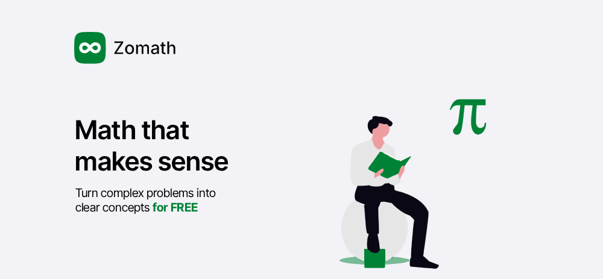
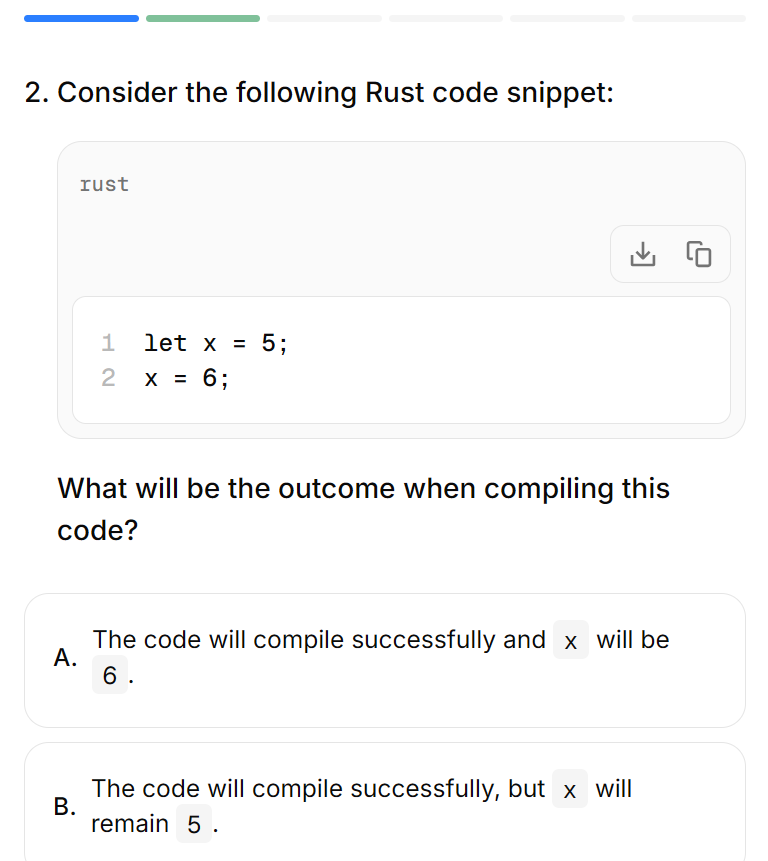
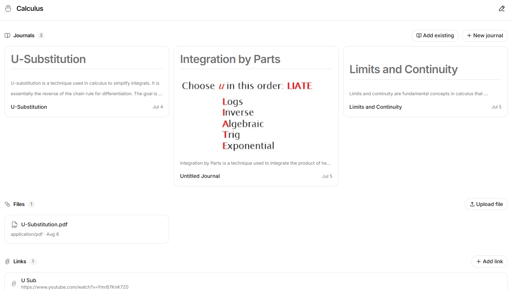
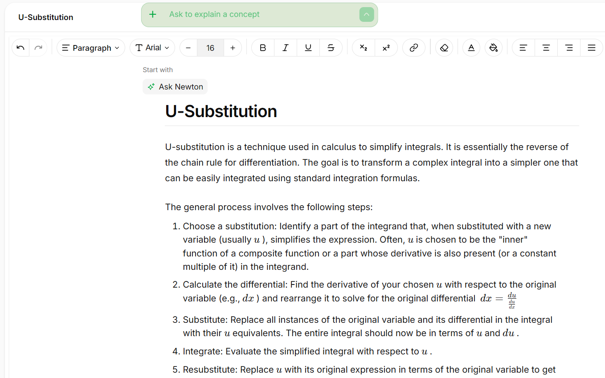
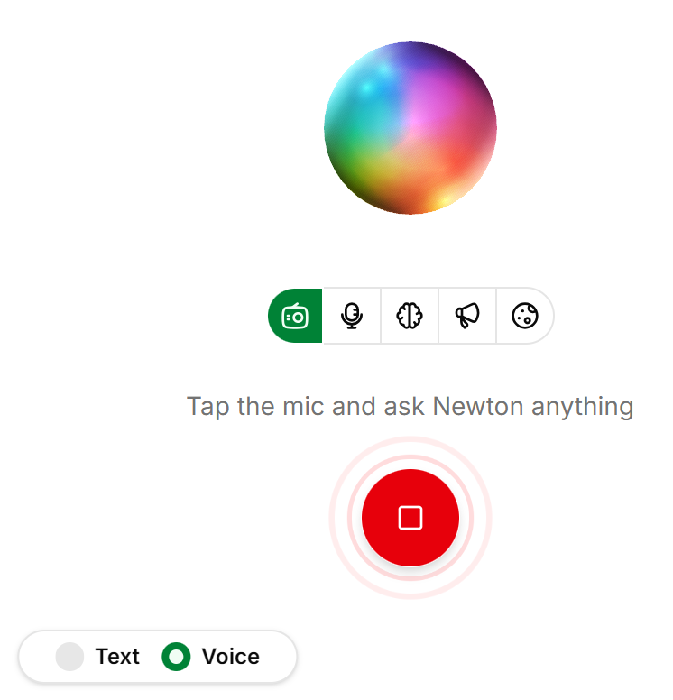
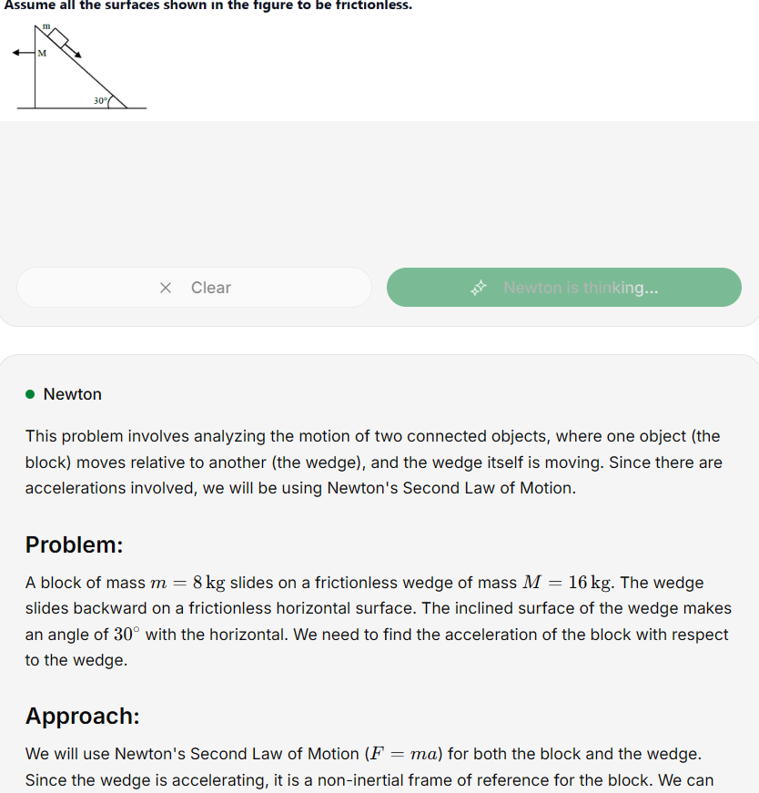

  
  <h1 align="center">Zomath</h1>

  Zomath helps students study by using AI to explain concepts, quiz themselves, and organize their notes. You can write notes in Journals and store those Journals and additional files in Projects.

   
  <a title="MIT License" target="_blank" href="https://github.com/ahmoin/zomath/blob/main/LICENSE.md">
  
  

---

## About

Zomath is a study math website mainly for math, where you can organize lecture notes and PDFs. You can ask the AI assistant Newton to explain concepts. You can take pictures of math problems and Newton will walk you through it step by step.

_[live website](https://zomath.vercel.app/)_

## Features

* **Practices** for testing yourself. There are 3 types of practices, quiz, match up, and flash cards. A quiz looks like this:

* **Projects** for organizing lecture notes, PDFs, web links, and questions in one place. A project looks like this:

* **Journals** for writing notes and documents. Journals use a rich text editor with LaTeX math rendering, code blocks, and text formatting. A journal looks like this:

* **Newton** for explaining concepts, figuring out the steps to solve problems, and learning the reasoning behind the steps. It has a text and voice mode. Newton voice mode looks like this:

* **Solve** for uploading a photo or screenshot of a problem and getting a breakdown / solution. Solve looks like this:

## Getting Started

Please visit the _[live website](https://zomath.vercel.app/)_ to get started.

## FAQ

### Is Zomath free to use?

Yes. You can try the live web app at [zomath.vercel.app](https://zomath.vercel.app). You can also clone the repository and self host it locally using your own API keys. Check [.env.example](/.env.example) for the required environment variables.

### What AI models does Newton use?

Newton uses the Vercel AI SDK connected through OpenRouter. This makes it flexible to route prompts to different models depending on the task, but the default model is Google's Gemini 2.5 Flash (`google/gemini-2.5-flash`).

### How are notes and files stored?

Journals use Dexie (IndexedDB) for fast local syncing in your browser, backed up to a Turso (LibSQL) database. History, projects, practices, project resources, and any other user data also goes in the Turso LibSQL database. Uploaded PDFs, images, and attachments inside Projects are stored on Vercel Blob.

### Can I self host or run Zomath locally?

Yes, you can follow the repo and set up your own environment variables for then run `pnpm dev` to locally run the project. Check [.env.example](/.env.example) for the required environment variables.

## License

This project is licensed under the [MIT license].

## Contribution

We'd love to have you contribute to Zomath! Please make a pull request to get started.

Unless you explicitly state otherwise, any contribution intentionally submitted
for inclusion in Zomath by you, shall be licensed as MIT, without any additional
terms or conditions.

[MIT license]: LICENSE.md
